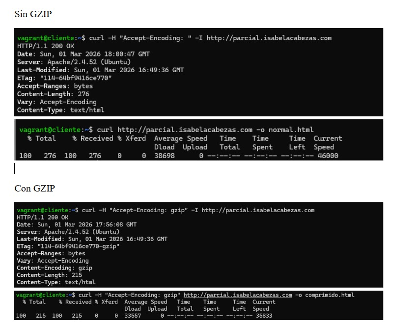

# Parcial Servicios Telemáticos

**Estudiante:** Isabela Cabezas  Obregon - Isabella Ortiz Hernandez - Samuel Sepulveda Castaño

**Repositorio:** Parcial-Servicios-Telematicos

---

#  Descripción General

En este parcial se realizó la implementación y configuración de:

1. Servidor DNS maestro con zona directa e inversa.
2. Restricción de transferencia de zona (AXFR).
3. Exposición pública del servidor mediante túnel seguro.
4. Configuración de servidor web Apache.
5. Implementación de compresión GZIP.
6. Verificación mediante herramientas de análisis.

---

# 1. Configuración DNS

Servidor DNS configurado con BIND.

##  Zona Directa

Archivo:

```
dns/db.empresa.local
```

Incluye:

* Registro A
* Registro NS
* Registro SOA

##  Zona Inversa

Archivo:

```
dns/db.192.168.50
```

Incluye:

* Registro PTR
* Resolución IP → Dominio

## Archivos de configuración

```
dns/named.conf.local
dns/named.conf.options
```

Se configuraron:

* Restricción de consultas
* Restricción de transferencia de zona (AXFR)
* Permisos y seguridad

---

# 2. Exposición con NGROK

Se utilizó túnel HTTP para exponer el servidor local a Internet.

Documentación en:

```
ngrok/README_NGROK.md
```

Se verificó acceso externo mediante URL pública HTTPS generada.

---

# 3. Servidor Web Apache

Se configuró VirtualHost apuntando al directorio:

```
/var/www/parcial/apache_gzip
```

Archivos web incluidos en:

```
web/
```

---

#  4. Compresión GZIP

Se habilitó compresión mediante módulo de Apache.

Se verificó presencia del header:

```
Content-Encoding: gzip
```




# Conclusión Técnica

La implementación integra servicios de red fundamentales:

* Resolución de nombres mediante DNS.
* Seguridad mediante restricción de transferencia.
* Publicación controlada del servidor web.
* Optimización de rendimiento mediante compresión.

Se validó cada configuración mediante pruebas funcionales y análisis de tráfico.

---

